<!-- ═══════════════════════════════════════════════════════════════════════════
     ⚡  S R I D H A R   S   ·   G I T H U B   P R O F I L E   R E A D M E
     v3.0  ·  Rebuilt from verified GitHub API data + 40 individually-audited repos
     ═══════════════════════════════════════════════════════════════════════════ -->

  

 

  

&nbsp;
&nbsp;
&nbsp;
&nbsp;

  

     

 

  

 

<!-- ══════════════════════ TERMINAL BOOT SEQUENCE ══════════════════════ -->

<pre align="center">
┌──────────────────────────────────────────────────────────────────────────────────┐
│  sridhar@universe:~$ ./init_developer.sh --source=github_api --mode=verified     │
├──────────────────────────────────────────────────────────────────────────────────┤
│                                                                                  │
│  [DATA]   GitHub account created ........................  2023-02-27           │
│  [DATA]   Public repositories ...........................  113                  │
│  [DATA]   Repos touched in June 2026 ....................  57  (>50% of total)  │
│  [DATA]   Single-day shipping sprint ....................  14 repos · Jun 27    │
│  [ENGINE] Three.js r128 + GSAP 3.12.5 (cinematic web layer) .......  ACTIVE     │
│  [ENGINE] PyTorch 2.0 + CUDA + Diffusers (applied ML layer) .......  ACTIVE     │
│  [ENGINE] Groq LPU · llama-3.3-70b-versatile ......................  WIRED     │
│  [ENGINE] Anthropic Claude API ....................................  WIRED     │
│  [CRED]   IEEE published · AWS Certified · IET member · Expo Award   VERIFIED   │
│                                                                                  │
│  ████████████████████████████████████████████████████████  100%  ONLINE        │
│                                                                                  │
│  ●  Every number above is pulled live from the GitHub REST API  ●               │
└──────────────────────────────────────────────────────────────────────────────────┘
</pre>

 

<!-- ══════════════════════ PROFILE TABLE ══════════════════════ -->

<table>
<tr>
<td width="52%" valign="top">

<pre>
╔══════════════════════════════════════════════════╗
║  IDENTITY   Sridhar S · Full-Stack AI Engineer   ║
╠══════════════════════════════════════════════════╣
║  DEGREE     B.E. Computer Science · HITS · 2025  ║
║  LOCATION   Tamil Nadu, India                    ║
║  STATUS     ● Open to AI/ML · Full-Stack ·       ║
║               Creative Tech opportunities        ║
╠══════════════════════════════════════════════════╣
║  WEB LAYER  Three.js r128 + GSAP 3.12.5          ║
║  AI LAYER   Groq LPU + Anthropic Claude API      ║
║  ML LAYER   PyTorch + CUDA + Diffusers           ║
║  DEPLOY     Netlify / Vercel · Global Edge       ║
╠══════════════════════════════════════════════════╣
║  ▸ IEEE  Author (ML Travel Recommendations)      ║
║  ▸ AWS   Cloud Practitioner Certified            ║
║  ▸ IET   Member                                  ║
║  ▸ National Project Expo Award Winner            ║
║  ▸ Java Development Internship                   ║
║  ▸ Cybersecurity Internship                       ║
╚══════════════════════════════════════════════════╝
</pre>

</td>
<td width="48%" valign="top">

<pre>
RECENT SHIPPING ACTIVITY  (live GitHub timestamps)

  AIdrawtoimage.AI (NeuroDraw)     2026-06-30
  MotionMaster Pro                 2026-06-29
  QuestionGenius Elite             2026-06-29
  QuantumViz AI                    2026-06-29
  Neural Conjecture Proposer       2026-06-28
  NEET Aspirants Hub               2026-06-28
  + 14 more repos in a single      2026-06-27
    24-hour sprint
  + 43 more repos across June 2026
</pre>

<pre>
╔══════════════════════════════════════════════════╗
║  READING THIS PROFILE                            ║
╠══════════════════════════════════════════════════╣
║                                                  ║
║  Two different kinds of work live here:          ║
║                                                  ║
║  ◆ CINEMATIC BUILDS — single HTML file, zero     ║
║    backend, Three.js + GSAP + an LLM API.        ║
║    Optimized for speed of iteration & polish.    ║
║                                                  ║
║  ◆ ML SYSTEMS — real inference pipelines:        ║
║    Stable Diffusion, ControlNet, CUDA, Flask/     ║
║    Gradio backends, GPU-scheduled workloads.      ║
║                                                  ║
║  Both are tagged below so you know which is       ║
║  which before you click.                          ║
║                                                  ║
╚══════════════════════════════════════════════════╝
</pre>

</td>
</tr>
</table>

 

<!-- ══════════════════════ STACK SIGNATURE ══════════════════════ -->

<pre>
/* ─────────────────────────────────────────────────────────────────────
   ⚡  S T A C K   S I G N A T U R E
   ───────────────────────────────────────────────────────────────────── */

const cinematicWeb() = ThreeJS_r128 + GSAP_3125 + ScrollTrigger   // → 95 of 113 repos
const appliedML()    = PyTorch + CUDA + Diffusers + ControlNet   // → NeuroDraw, MotionMaster
const intelligence() = Groq_LPU(llama_3_3_70b) + Anthropic_API   // → AI layer, most projects
const dataViz()      = ChartJS + D3v7 + Plotly + MathJax         // → analytics-heavy builds
const backend()      = Flask + Gunicorn + Node_proxy + Docker    // → the ML-system minority
const ship()         = Netlify + Vercel + ZeroInfraCost          // → 113 deployments

const result() → "One engineer, fluent in both spectacle and substance."
</pre>

 

&nbsp;

&nbsp;

&nbsp;

 

  

 

  

 

<!-- ═══════════════════════════════════════════════════════════════════════════
     ⚡  F L A G S H I P   P R O J E C T S  —  A U D I T E D   I N   D E P T H
     ═══════════════════════════════════════════════════════════════════════════ -->

## Flagship Projects — Audited In Depth

Every project below was individually opened and read — architecture, stack, and claims are pulled from the actual source and README, not from a pitch.

 

<table>
<tr>
<td width="100%" valign="top">

### 🎨 NeuroDraw — AI Sketch-to-Image Pipeline

**Python · PyTorch · CUDA · Flask · Docker** | [Source](https://github.com/sridhar242004/AIdrawtoimage.AI)

A real, locally-hosted generative pipeline: **ControlNet (scribble v1.1)** locks structure to your sketch via adaptive Canny edge detection, **Stable Diffusion v1.5** renders the image, and **CLIP ViT-B/32** handles semantic alignment. Served through a single-worker Flask + Gunicorn app with Docker/`nvidia-docker` GPU passthrough, xFormers memory optimization, and a background daemon model loader so the first request isn't the slowest one.

     

</td>
</tr>
</table>

<table>
<tr>
<td width="100%" valign="top">

### 🎬 MotionMaster Pro — Dual-Engine AI Video Synthesis

**Python · PyTorch · CUDA · Gradio · Diffusers** | [Live Front-End](https://motionmastor.vercel.app/) · [Source](https://github.com/sridhar242004/MotionMaster)

Two production diffusion pipelines behind one Gradio session on a 24GB L4 GPU: **I2VGenXL** for image-to-video generation and **SDXL** for cinematic frame synthesis, chained with automated prompt engineering, OpenCV post-processing, and gTTS voiceover into a full storyboard-to-MP4 pipeline.

    

</td>
</tr>
</table>

<table>
<tr>
<td width="100%" valign="top">

### 📝 QuestionGenius Elite — AI Assessment Engine

**Vanilla JS · CSS · Node.js proxy · Groq LPU** | [Live Demo](https://questiongenius-vercel-fixed.vercel.app/) · [Source](https://github.com/sridhar242004/question-qenius)

A two-HTML-file frontend — zero React, zero Webpack, zero TypeScript compiler — paired with a thin Node.js proxy that pipelines any document through Groq's LPU into structured, pedagogically-calibrated exam questions in under two seconds. Every visual effect (scramble-text hero, magnetic cursor, scroll-hijacked gallery, 3D-tilt cards) is raw CSS/JS measured at Lighthouse 94+. Ships a regex-based offline fallback question generator for when the backend is unreachable.

   

</td>
</tr>
</table>

<table>
<tr>
<td width="100%" valign="top">

### 📊 QuantumViz AI — Real-Time Data Intelligence

**React · JavaScript · Chart.js · Plotly · D3** | [Live Demo](https://quantumviz-vercel.vercel.app/) · [Source](https://github.com/sridhar242004/Quantum_Interactivecharts)

A zero-backend data platform that runs entirely client-side: drop a CSV, pick from 15 client-side ML algorithms across 12 chart types, and watch a Groq-streamed AI commentary render alongside the visualization — no installs, no server round-trip for the analysis itself.

    

</td>
</tr>
</table>

<table>
<tr>
<td width="100%" valign="top">

### 🧮 Neural Conjecture Proposer — Constrained Math Discovery Engine

**Vanilla JS · Bootstrap · MathJax · Groq LPU** | [Live Demo](https://math-conjecture-vercel.vercel.app/) · [Source](https://github.com/sridhar242004/MathsAI)

Turns an LLM into a constrained conjecture-generation instrument rather than an open-ended chatbot: an 8-domain × 7-statement-type × 4-complexity-tier parameter grid, paired with a strict markdown header contract the client deterministically parses into structured fields with one parameterized regex — LaTeX rendering, history, analytics, and batch runs all sit on top of that single parsing contract.

   

</td>
</tr>
</table>

<table>
<tr>
<td width="100%" valign="top">

### 🧬 NEET Aspirants Hub — AI Study Mentor Platform

**Three.js · GSAP · Groq LPU** | [Source](https://github.com/sridhar242004/NEET-Aspirants-Hub)

A single-file, zero-build landing experience for India's NEET-UG aspirants: a Three.js molecular hero, a GSAP-choreographed scroll narrative, and an AI study mentor ("Dr. NEET") shipped as one portable `index.html` with partial `prefers-reduced-motion` support.

  

</td>
</tr>
</table>

 

  

 

<!-- ═══════════════════════════════════════════════════════════════════════════
     ⚡  N O T A B L E   B U I L D S  —  C A T A L O G
     ═══════════════════════════════════════════════════════════════════════════ -->

## Notable Builds Catalog

113 repositories, organized by domain. Titles below are each project's own branded name — every build ships with its own identity, not just a feature.

 

**AI Tools & Assistants**

| Project | Branded As | What It Does |
|---|---|---|
| [idea_generator](https://github.com/sridhar242004/idea_generator) | IdeaSpark — The Singularity Laboratory | Neural-hero business/idea generator with Groq streaming |
| [Researcher_AI](https://github.com/sridhar242004/Researcher_AI) | ResearchAI Pro | Scholarly paper search with one-click citation export |
| [translator_AI](https://github.com/sridhar242004/translator_AI) | LinguaFlow | Real-time context-aware AI translation, 3D language globe |
| [Linkedlncoverpage.ai](https://github.com/sridhar242004/Linkedlncoverpage.ai) | ProCover AI | AI-generated LinkedIn cover banner tool |
| [startup.ai](https://github.com/sridhar242004/startup.ai) | HealthTech Competitive Intelligence | AI market/competitive analysis dashboard |
| [resume-builder](https://github.com/sridhar242004/resume-builder) | ResumeAI Pro | ATS-aware AI resume builder with skills radar |

**Health, Wellness & Genomics**

| Project | Branded As | What It Does |
|---|---|---|
| [Health-Twin](https://github.com/sridhar242004/Health-Twin) | HealthTwin — Predictive Biology Platform | DNA-helix hero, Groq health chat, biometric dashboard |
| [Neuro_VR-for-phobia](https://github.com/sridhar242004/Neuro_VR-for-phobia) | NeuroVR Therapy | VR exposure-therapy concept with biofeedback framing |
| [Personalized-Digital-Detox-Assistant](https://github.com/sridhar242004/Personalized-Digital-Detox-Assistant) | ZenMode | Gamified digital-detox platform, streak analytics |
| [Interactive-Genomic-Data-Explorer](https://github.com/sridhar242004/Interactive-Genomic-Data-Explorer) | GeneX — Genome Browser & Analyzer | D3-driven genomic data explorer |
| [Foot-Print-Calculator](https://github.com/sridhar242004/Foot-Print-Calculator) | EcoTrack — Carbon Intelligence | AI-assisted carbon footprint tracker |

**Creative, Immersive & Editorial**

| Project | Branded As | What It Does |
|---|---|---|
| [virtual-art-gallery-and-vr-gallery](https://github.com/sridhar242004/virtual-art-gallery-and-vr-gallery) | NEOBRUT — VR Art Gallery | Spline 3D + Three.js immersive gallery, AI curator |
| [neo-brutal](https://github.com/sridhar242004/neo-brutal) | NEO.BRUTAL+ — Editorial Systems Studio | Award-target editorial site, AI Bento Architect |
| [story-Reader](https://github.com/sridhar242004/story-Reader) | NarrativeAI — Intelligent Story Companion | AI story reader with translation & TTS highlighting |
| [SOUND_SCAPE](https://github.com/sridhar242004/SOUND_SCAPE) | SoundScape | Browser-based synth engine, sequencer & patch bay |
| [MAX-TYPO](https://github.com/sridhar242004/MAX-TYPO) | TYPEVERSE | Kinetic typography exhibition |
| [80s](https://github.com/sridhar242004/80s) | 80s EXCESS | Retro broadcast-styled interactive experience |
| [Fashion-Ai-](https://github.com/sridhar242004/Fashion-Ai-) | MAISON ARIA — Digit
